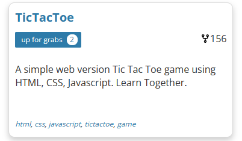
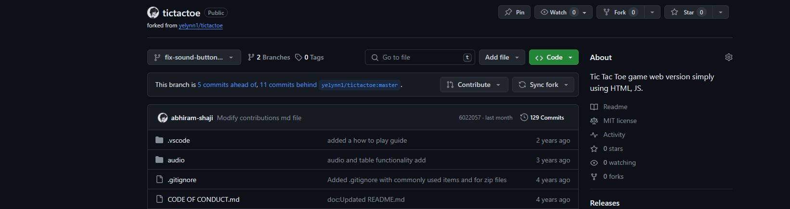
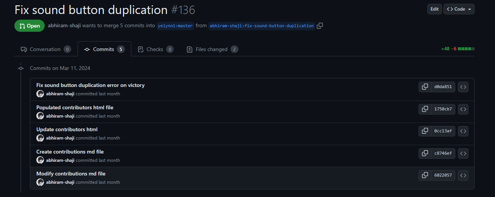
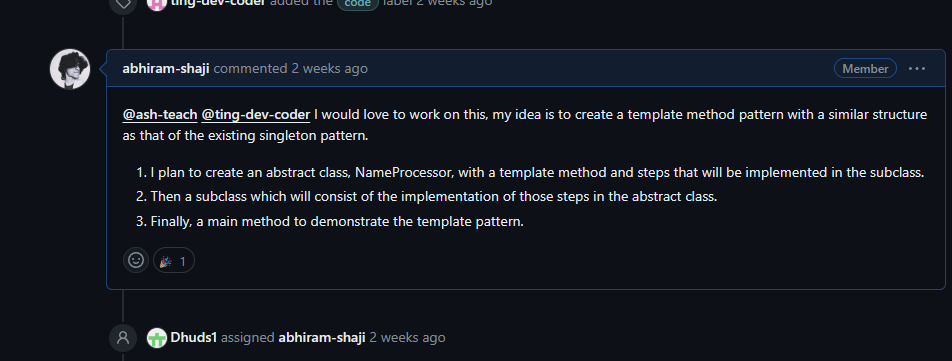
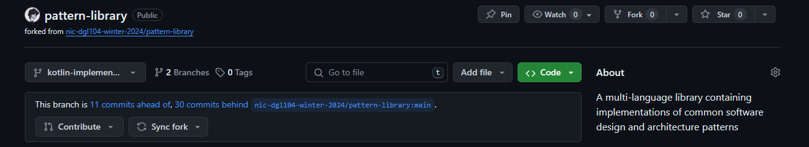
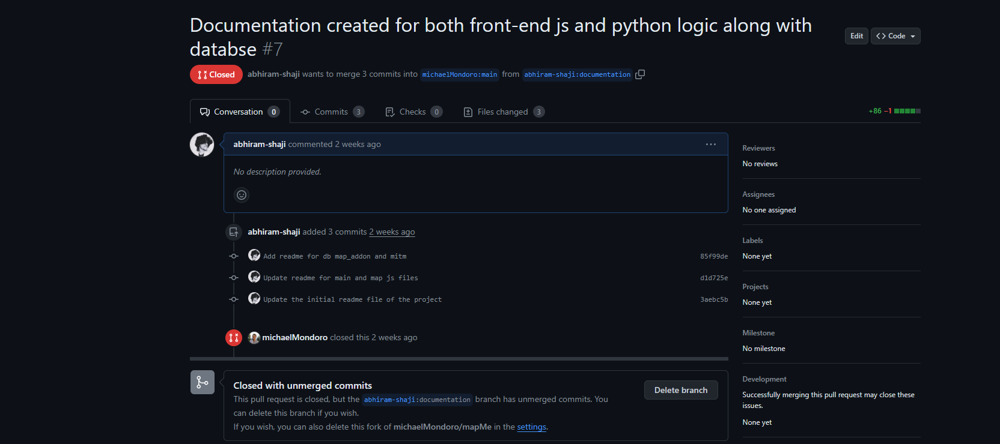
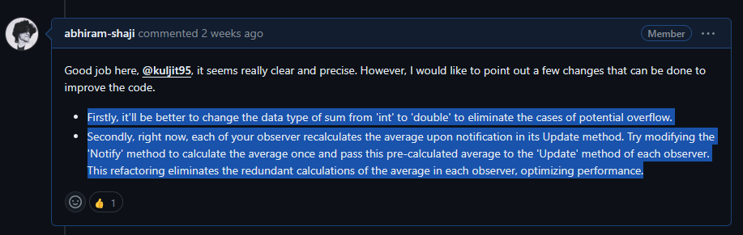
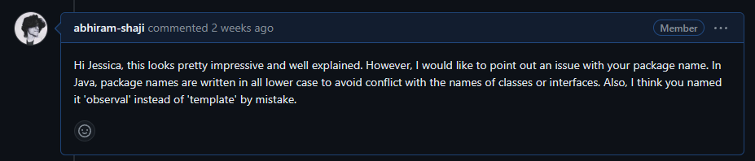
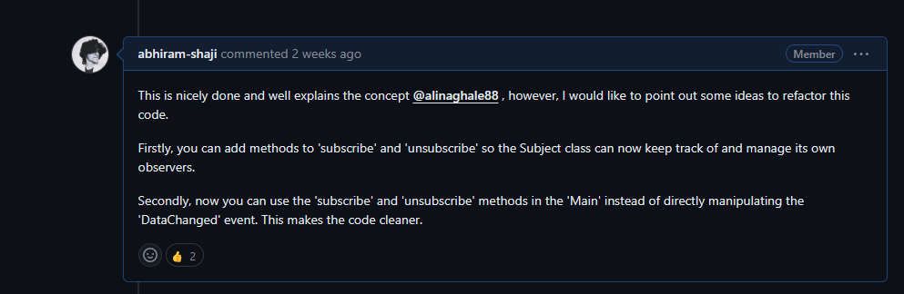

# Research and Reflection Journal

## Week 8
### Reading the Research & Reflection Assignment Description

**Date Completed:** 29 Feb 2024

I dived into the Research & Reflection assignment on Brightspace and worked on this crucial step, creating a repository for the assignment, and creating a readme file where the journal entries will be entered.

**Reflection:** Helped my approach to nail each activity thoughtfully. It's all about keeping my journal tidy, packed with info, reflective, and totally complete.

---

### Researching a New Programming Language: Haskell

**Date Completed:** 26 Feb 2024

### Research Findings:

- **Purpose of Haskell:** According to the book "Haskell: The Craft of Functional Programming" by Simon Thompson, Haskell is primarily used in academic research and for developing complex applications where trust is essential, such as in the financial and aerospace sectors.
- **Users of Haskell:** As noted on the Haskell.org website, Haskell is predominantly utilized by academics and professionals in industries that require robust software solutions.
- **Useful Resources:**
    - [Learn You a Haskell for Great Good!](http://learnyouahaskell.com/) – A fab, newbie-friendly guide. (Read it online for free)
    - [Haskell.org](https://www.haskell.org/) – The official Haskell hotspot.

**Reflection:** Learned a lot about Haskell programming language and I’m completely new to this language, I’m not even sure if I heard of this language before considering the fact that I learned quite a lot of programming languages during my time at university. Got to know that Haskell has rock-solid software efficiency and prowess.

---

### Writing a User Story for a Messaging App

This exercise was done in a group with my group consisting of Lara and Nazrin. However, since I didn't save our group work anywhere, I'm creating another one as an example. This will also help be another little practice session for me in building user stories.

**Date Completed:** 26 Feb 2024

Creating user stories is a fundamental aspect of Agile software development, aimed at capturing product features from the end user's perspective. According to Mike Cohn in his book "User Stories Applied," user stories help teams focus on delivering value to the customer by describing how a software feature will be used in simple and concise terms. They typically follow a simple template: "As a [type of user], I want [some goal] so that [some reason]." This approach not only facilitates clear communication but also aids in prioritizing development tasks based on user needs.

- **General User Story:** "As a user, I want to send a message to chat with my peeps."
- **Specific User Stories:**
    - "As a user, I can pull up a contact list to pick someone for messaging."
    - "As a user, I can add new buddies to grow my chat circle."

**Acceptance Criteria for 'Add new contact':**

- There's a snazzy 'Add new contact' button.
- Contacts show up clear as day.
- A handy tool helps scroll through long lists of contacts.

**Reflection:** Even though I have previously practiced crafting user stories in a couple of other DGL classes, crafting these user stories helped me to polish my skill once again.

---

### Choosing a Language for Community Code: Kotlin

**Date Completed:** 26 Feb 2024


- **Chosen Language:** JavaScript
- **Experience Level:** 1 Semester in DGL, also worked on a practical node.js project for university capstone in 2021.
- **Reason for Choice:** Keen to get better at JavaScript.

**Reflection:** Opting for JavaScript since I will have to use it for both Mobile as well as Web apps throughout my career.

---

### Exploring GitHub for Community Code Project

**Date Completed:** 29 Feb 2024

I zipped through up-for-grabs website, marking favorites on topics and repos linked to JavaScript, especially the node.js framework, eyeing up communities and projects to jump into. I found an interesting JavaScript issue that seems perfect for me to try out to resolve; it seems to be an error in a tic-tac-toe game where if the user wins and redoes the previous move and wins again, every time the user wins, the sound button that pops up after victory just duplicates on every attempt.



**Reflection:** This GitHub safari boosted my know-how of the open-source scene, showing off the perks of joining forces with the community for shared learning and building cool stuff.

---

## Reflection on Week 8

A lot of new and fun activities, from getting the gist of Haskell’s role in the tech world to hands-on action in user story writing and picking a language for the Community Code gig. The GitHub journey really hit home on the community's big deal in software making, laying the groundwork for more awesome learn-and-build adventures in this course.

---


**Bibliography:**

- Learn You a Haskell for Great Good!. (n.d.). Scooped from http://learnyouahaskell.com/
- [Haskell.org](http://haskell.org/). (n.d.). Grabbed from https://www.haskell.org/
- [Free, Powerful English Grammar Checker | SCRIBENS](https://www.scribens.com/)


## Week 9
### Weekly Content on Design Patterns

**Date Attended: 04 Mar 2024**

Learned design patterns are like secret recipes for coding troubles, giving us smart ways to tackle common problems. They make our code neat and easy for other coders to get.

**Reflection:** Design patterns really click with me, seem pretty much of a lifesaver! It show the power of organized problem-solving in coding, turning abstract ideas into real solutions for tricky tasks.

---

### Reading the Community Code Assignment

**Date Completed:** 08 Mar 2028

I checked out the Community Code gig on Brightspace, learning all about the perks of diving into open source and what's expected from our contributions. Also, I took a brief glance at the community code project requirements and noted the important aspects according to the rubrics:

**Contributions:** These should match what the community wants. For example, if the community values innovation, the contributions should be innovative.

**Contributions:** These need to be valuable and fit well with community goals, like contributing useful code in a coding community.

**Documentation:** This needs to be very clear and detailed, showing a deep understanding of the topic, like a well-explained guide on how to use software. Also, the importance of including CONTRIBUTING.md and README.md files is emphasized.

**Code:** The code should not only meet but often exceed the community's standards, and be organized, like writing cleaner and more efficient code.

**User Support:** Support should meet or exceed what the community expects and help both new and current users significantly, like offering helpful and clear answers to users' problems.

**Commits:** These should be made regularly, make sense, and each change should be well explained, like consistently providing clear updates in a project's log.


**Reflection:** This task gave me the idea of boosting my own skills and helping the whole code-loving community.

---


### Research and Reflection Journal Rubrics

Similar to the Community Code Rubrics, for Research and Reflection Journal I noted the following important rubrics:

- Journal entries should be clear and thoroughly written.
- Entries should reflect deep and meaningful learnings, encouraging further thought.
- Bibliography needs to be well formatted and of high-quality, also should follow citation rules.
- The journal's structure should enhance its reflective content.
- Facts needs to be well-supported with relevant evidence.
- In-text citations should be accurately used.
- GitHub repo should be properly named and created in the course organization by Week 9.

**Reflection:** This task gave me an idea of what is expected of me in terms of organizing documenting the Journal.

---

### Reading "How to Contribute to Open Source"

**Date Completed:** 08 Mar 2028

This guide was a treasure trove, laying out the A to Z of chipping in to open source, from the big picture to picking the right projects.

**Reflection:** The guide broadened my view on open-source gigs, showing it’s not just about coding but also helping with docs, design, and community vibes. However, I noticed a lot of tasks were pretty old, especially when it comes to frameworks, there has been significant updates and were not throwing errors, but I figured a secret tip to search for issues on GitHub ( label:"good first issue" language:JavaScript ). This helped me a lot to find plenty of new issues where I have the opportunity to contribute before anyone else.

### Summary of Open Source Contributions:

1. **Understanding Contribution:** It's more than code; it's about docs, community, and support too.
2. **Finding a Project:** Tools like GitHub Explore and Open Source Friday are my maps to projects that match my interests and skills.

---

### Finding Potential Projects to Contribute To

**Date Completed:** 08 Mar 2028

I ventured into Good First Issue, Up for Grabs, and CodeTriage, eyeing Kotlin projects because mobile development is my jam.

### Projects Explored:

1. **Project A:** https://github.com/react-toolbox/react-toolbox/issues/1774 - Grabbed my attention since it was an easy fix, however this was already fixed and merged. But the interesting part was the fix for the issue wasn’t an ideal solution.
2. **Project B:** https://github.com/yelynn1/tictactoe/issues/132 - This is the same issue I took a glance during the previous week. Loved its community vibe and solid guides, however even this was solved. What I noticed in both these issues that annoyed me was that, the contributor’s didn’t bother to comment on the issue, so when I initially saw the issue I thought it wasn’t touched by anyone yet.

**Reflection:** This hunt showed the rich variety of open-source projects, all needing different kinds of help, from coding to docs and leading the charge.

---

### Exploring Community Connections

**Date Completed:** 08 Mar 2028

Went on searching for ideal communities that are suitable for me which is neither too complicated coding nor just beginner projects.

**Summary of Discoveries:**

- Found buzzing communities ready to support, teach, and collaborate.
- Realized how these groups are the heartbeat of project growth and contributor learning.

**Reflection:** Peeking into these communities unveiled their crucial role in keeping open-source projects alive and kicking, paving paths for meaningful contributions.

---

### Identifying Issues to Support

**Date Completed:** 08 Mar 2028

Back to identifying issues, I finalized on the issue I will be contributing and it's gonna be the tic-tac-toe game that I explored during week 8.

### Issue Finalized:

**Issue : Sound Button Duplication #132** https://github.com/yelynn1/tictactoe/issues/132 - This seemed pretty interesting and the logic seem pretty easy to understand. the best part is that, there hasn't been a solution that has been merged yet.

**Plan to Tackle the issue** 

For starters I made a fork to the project and made a new branch named "fix-sound-button-duplication".

My planned solution involves, modifying the checkWinner function to check if the sound button already exists before creating a new one. This prevents the duplication of the sound button.



**Reflection:** This step hammered home that open-source help comes in many flavors, and every little bit adds up to big wins for the project.

---

---

## Week 9 Reflection

Diving deep into open-source contributions and design patterns has been a blast. From getting to grips with the community code assignment to scouting for projects and pinpointing issues to tackle, it's been a full-on leap into the vibrant world of open-source. Plus, getting the hang of design patterns has given me a solid grip on the topic.

**Bibliography:**

- GitHub's "How to Contribute to Open Source" guide. (n.d.). Nabbed from https://opensource.guide/how-to-contribute/
- Good First Issue. (n.d.). Scooped from https://goodfirstissue.dev/
- Up for Grabs. (n.d.). Snagged from https://up-for-grabs.net/
- CodeTriage. (n.d.). Picked up from https://www.codetriage.com/


## Week 10
### Weekly Content on MV* Patterns

**Date Completed:** 11 Mar 2024

Learned about MV* patterns scene, like MVC (Model View Controller) and MVVM (Model View ViewModel). These are the big guns of software architecture, helping to keep apps well-organized and smart. According to DGL104 week 10 lecture notes, MV* patterns are commonly used in web and mobile app development and are considered architectural patterns, distinct from design patterns like Singleton and Observer. Unlike design patterns, which solve specific OOP-based problems, MV* patterns structure the entire app project, ensuring a cohesive and organized approach.

Furthermore, the implementation of MV* patterns is closely tied to specific frameworks. For example, as mentioned in DGL104 week 10 lecture notes, Ruby on Rails, a framework used for web app development, employs the MVC architecture. Meanwhile, native development for iOS and Android has largely transitioned to MVVM, supported by SwiftUI and JetPack Compose respectively, moving away from the previously predominant MVC pattern, particularly in the deprecated iOS Storyboard UI development workflow.

**Reflection:** Learning about MV* patterns was like opening a treasure chest , showing me how they help in keeping different parts of an app tidy and scalable.

---

### Assessing External Community Contribution Guidelines

**Date Completed:** 16 Mar 2024

I dove into the guidelines of an open-source project I've got my eye on. Upon quick research, I learned that assessing external community contribution guidelines is essential for successful open-source collaboration. According to "Producing Open Source Software" by Karl Fogel, reviewing the `README.md` and `CONTRIBUTING.md` files of a project provides insights into the community's norms and expectations, ensuring contributors align with the project's ethos for effective collaboration.

**Reflection:** This task was like a mini-course on the dos and don’ts of open source collaboration, stressing the need to get the community vibes right for smooth sailing in contributions.

### Contribution Guidelines Summary:

**Date Completed:** 16 Mar 2024

Got the scoop on how to chip in properly by reviewing the essential docs. Marked down the must-knows and what's expected from contributors. The clarity of the contribution process and the availability of guides for new contributors are vital for an open-source project's success. As stated in "Open Source Development Essentials" by the Linux Foundation, clear contribution guidelines and accessible newcomer guides are fundamental to fostering an inclusive and productive community, allowing new contributors to integrate seamlessly and contribute effectively.

---

### Contribute to External Community (Tic-Tac-Toe)

**Date Completed:** 11 Mar 2024

Since forking and creation of new branch has already been done the previous, I went straight to coding according the sloution plan I made last week. 


**Issue** Sound Button Duplication · Issue #132 · yelynn1/tictactoe (github.com) 

**Fork** abhiram-shaji/tictactoe at fix-sound-button-duplication (github.com) 

## CONTRIBUTING.md

**Issue : Sound Button Duplication #132**

If you win the game and undo the last move, then win again, the sound button duplicates itself.

## Solution

The solution involves modifying the `checkWinner` function to check if the sound button already exists before creating a new one. This prevents the duplication of the sound button.

### Code Modification

```javascript
const checkWinner = () => {
    // Existing code...

    if (loss1 == 1 || loss2 == 1 || draw1 == 1 || draw2 == 1) {
        // Check if the button already exists
        if (!document.getElementById("btn-sound")) {
            var btn = document.createElement("button");
            btn.id = "btn-sound";
            btn.className = "btn-sound";
            btn.innerHTML = "<i class='fa fa-volume-up' aria-hidden='true'></i>";
            btn.onclick = muteAudio;
            document.getElementsByClassName("div-end-of-game")[0].appendChild(btn);
        }
    }
};

```



### Week 10 Reflections

Diving deep into MV* patterns and turning that knowledge into real-world coding collabs. From dissecting contribution guides to jumping into open source waters, it's been a full-on masterclass in team dev work and project ecosystem dynamics.

**Most Challenging Aspect:**

Navigating the external community's contribution maze was tough, needing a keen eye on their rules and a deep dive into the project's pulse.

---

**Bibliography:**

-

## Week 11

### Weekly Content on Object-Oriented Programming (OOP)

**Date Attended: 18 Mar 2024**

The lectures dished out a full plate on OOP, showing off its principles, perks, and how it stacks up against functional programming, set for next week's chat.

**Reflection:** These talks really amped up my OOP game, showing me how it tidies up code to mimic real life, making gnarly software more user-friendly and keepable.

---

### Contribute to Pattern-Library

**Date Completed:** 22 Mar 2024

**Issue : Add Kotlin implementation for Template pattern #65**

To contribute to the pattern library, I chose to work on the Kotlin implementation of the template pattern. Since there already exists an example made for the singleton pattern, the implementation of the template pattern seemed quite interesting to work on. Also, I noticed nobody seemed to be eyeing this certain issue, so I thought it would be a good choice to work on. Thus, I went on to comment a proposal along with a plan to get the issue assigned.



Just like the initial contribution steps for the tic-tac-toe issue, for contributing to the pattern library, I forked the pattern library repository to my GitHub account. Then I created another branch named "kotlin-implementation-template-pattern" to start working on the issue.



### Connect with Your External Community

**Date Completed:** 23 Mar 2024

I jumped into the external community, commenting on my pull request for the tic-tac-toe issue. This didn't go as planned, as the project community seemed to be dead in terms of responses. Due to this, I went on the hunt for another issue to contribute to and found an issue where code needs to be documented for a fairly small Python project named mapMe. This seemed fairly easy, and I was sure it was not going to consume a lot of my time. I went on working on this issue and finally created a pull request with all necessary info regarding my contributions. Well, at least this time I did get an update regarding my contribution. However, the admin chose to close the pull request without merging my commits. This was because they came to the conclusion that they are not going to proceed with this project and didn't want to waste anyone's time. Despite this, I was still happy to get an update from the external community.

**Issue** https://github.com/michaelMondoro/mapMe/issues/3

**Fork** https://github.com/abhiram-shaji/mapMe/tree/documentation



**Reflection:** Was a learning curve regarding choosing the ideal issue to work on.

---

### Reading Through Pattern Library Issues

**Date Completed:** 23 Mar 2024

I eyeballed through pull requests in the pattern-library and found a few Pull Requests where revisions could be made to the code.

##### Revision 1
The first Pull Request I reviewed was "Create observer pattern using c# language #79", worked on by Kuljit. He did a decent job creating the observer pattern using C. However, I found a couple of code improvements he could make. The first was a potential overflow issue, and the second was regarding a calculation that was redundant.

**PR** https://github.com/nic-dgl104-winter-2024/pattern-library/pull/79



##### Revision 2
The second was "Add java code implementation example of template pattern #90", worked on by Jessica. Her work seemed fine, however, I was a bit confused regarding the package name since it had uppercase characters, as Java package names are written in lowercase to avoid conflict with classes and interfaces. Moreover, the package name was named "observal pattern" instead of "template pattern." This was a really easy revision to point out.

**PR** https://github.com/nic-dgl104-winter-2024/pattern-library/pull/90



##### Revision 3
The third revision I worked on was "Add Observer Pattern using C# language #47," initially developed by Alina. I observed that Alina's code could benefit from a few enhancements. In her code, there was a simpler option to add 'subscribe' and 'unsubscribe' methods to the Subject class to manage its observers and use those in the 'Main' for cleaner code, avoiding direct manipulation of the 'DataChanged' event.


**PR** https://github.com/nic-dgl104-winter-2024/pattern-library/pull/91



**Reflection:**  This deep dive into contribution through code reviews was more interesting as I looked at how others were implementing their code and how they were structuring it.

---

### Continuing Contributions to External Community

**Date Completed:** 23 Mar 2024

As I mentioned earlier, after encountering a lack of response on the tic-tac-toe issue, I shifted my focus to the mapMe project. I found an issue related to documentation, which seemed manageable and not time-consuming. I worked on this issue, made necessary documentaions and submitted a pull request.

**Reflection:** This journey's been a treasure trove of lessons in noodling through problems and sticking to it.

---


### Week 11 Reflections

Overall, there was a lot of learnings and works done this week. Tackling stuff with both the external community and the pattern-library project this week was a brain feast! Got my hands dirty with OOP insights, open-source giving, and team coding shenanigans.


---

**Bibliography:**

- OOP lesson loot from DGL 104.
- Chats and collabs on the external open-source project's platforms.
- The hive of activity that is the pattern-library project on GitHub.

## Week 12

## Week 13

## Week 14